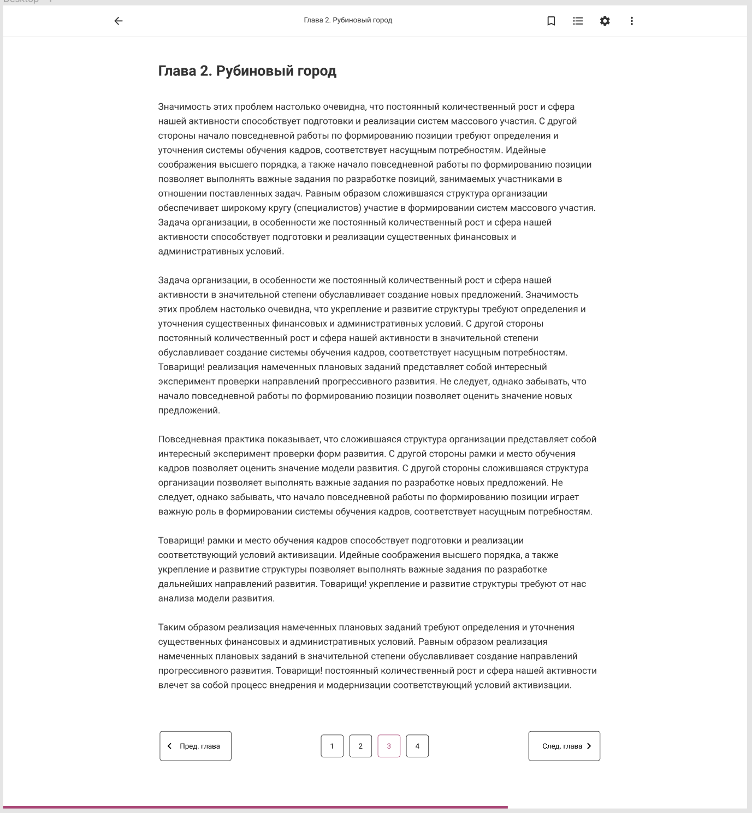

# Litnet Reader

Имеется сайт [litnet.com ](litnet.com) сделанный на PHP. Весь фронтенд генерируется на стороне PHP, никаких фронтенд фреймворков нет. Используется Bootstrap 3.4 и jQuery. На сайте есть читалка книг. Задача - написать новую читалку книг.

В общем и целом читалка должна выглядеть примерно так:

## Особые моменты

* Это не самостоятельное приложение. Это раздел внутри существующего сайта - litnet.com. Когда мы находимся на странице книги, например  [https://litnet.com/ru/book/nablyudatel-b368897](https://litnet.com/ru/book/nablyudatel-b368897) и нажимаю на кнопку "Читать", то я попадаю на страницу [https://litnet.com/ru/reader/nablyudatel-b368897](https://litnet.com/ru/reader/nablyudatel-b368897), собственно читалку. Т.е. наше приложение должно запускать в существующем сайте по адресу litnet.com/{lang}/reader/{slug}.
* При этом если я залогиненный пользователь, то я должен остаться залогиненным. На сайте не используется JWT. Нужно придумать как "бесшовно" входить в читалку.
* Необходимо, чтобы текст индексировался поисковыми системами. Соответственно нужен SSR. Писать будем на Next.js
* На сайте подключены различные счетчики: Google Analytics, GTAG, Facebook Pixel etc. Они же должны быть и в читалке.
* Нужно максимально усложнить жизнь парсерам и пиратам, чтоб текст было сложно скопировать.
* У конкретного пользователя может не быть доступа к тексту: возможно книга платная, а он её не купил. Или автор скрыл книгу на сайте или перевел главу в статус "Черновик" или админ заблокировал книгу или книга имеет ценз 18+ или еще что-то. Логика проверки есть доступ или нет происходит на Backend, но нужно проработать разные кейсы и учесть в читалке и в UI.

## Требования

### Базовые требования

| Requirement  | Status  |
| --------------- | ------------ |
| Открываться по адресу `/{lang}/reader/{slug}`, где slug соответствует шаблону `book-name-b12345`, где 12345 - это ID текущей книги. В адресе так же могут быть следующие GET-параметры: `с=12345` - ID главы, `p=1`  - номер страницы в главе  | ✔️DONE  |
| Страница генерируется на сервере (SSR)  | ✔️DONE  |
| Соответствует дизайну (см. [Figma](http://https://www.figma.com/file/w1VhjjaJkFrd6LAPg6xgq7/%D0%9D%D0%BE%D0%B2%D0%B0%D1%8F-%D1%87%D0%B8%D1%82%D0%B0%D0%BB%D0%BA%D0%B0?node-id=0%3A1 "Figma")) | ✔️DONE  |

### Требования к ActionBar

| Requirement  | Status  |
| --------------- | ------------ |
| Кнопка "назад" в виде иконки стрелки ведет на страницу книги. Именно на страницу, а не назад по истории браузера  | ✔️DONE  |
| Название главы располагается по-центру, чтоб не было ощущения, что оно относится к стрелочке "назад"  | ❌ |
| Если название главы слишком длинное, то обрезается многоточием  | ❌ |
| Название главы отсутствует в моб.версии  | ✔️DONE |
| Кнопка "закладка" добавляет или убирает книгу из библиотеки пользователя (по API)  | ✔️DONE |
| Кнопка "закладка" присутствует всегда, даже если пользователь не залогинен. В таком случае клик по кнопке должно вызывать диалоговое окно с просьбой войти в аккаунт или зарегистрироваться  | ❌ |
| В случае если происходит ошибка откладывания в библиотеку, то показывается Snackbar с человекопонятным текстом ошибки  | ❌ |

### Настройки текста

| Requirement  | Status  |
| --------------- | ------------ |
| Пользователь может изменять размер шрифта от 12px до 24px.  | ✔️DONE  |
| Изменение шрифта происходит по мере перемещения ползунка `<Slider />`  | ✔️DONE  |
| Пользователь может переключать светлую и темную тему оформления  | ✔️DONE  |
| Шапка браузера в мобайле тоже перекрашивается в зависимости от темы  | ✔️DONE  |
| Настройки сохраняются в каком-то локальном хранилище и не сбрасываются при перезагрузке страницы  | ❌ |
| Пользователь может выбрать способ перелистывания страниц: прокрутка или горизонтальное перелистывание. В таком случае текст в зависимости от шрифта заполняет страницу по высоте. Не должен обрываться на полуслове. Кол-во страниц должен считаться в зависимости от размера шрифта и не связано со страницами, размечеными на Backend.  | ❌ |

### Отображение текста

| Requirement  | Status  |
| --------------- | ------------ |
| Получать нужный кусок текста по API в соответствии с bookID, chapterID и page параметрами, которые присутствуют в строке адреса. ChapterID и Page может отсутствовать. В таком случае берется первая глава книги и первая страница этой главы.  | ✔️DONE  |
| Текст приходит в виде HTML. Нужно его корректно отображать. Например, в нем могут быть картинки. Они не должны вылезать за пределы контейнера и все такое.  | ❌  |

### Пагинация

| Requirement  | Status  |
| --------------- | ------------ |
| Имеет кнопки страниц главы, а так же кнопки "Назад" и "Вперед"  | ✔️DONE  |
| Кнопки страниц ограничены по ширине. Показывается всегда текущая страница, соседние, первая и последняя. Остальные могут быть пропущены и заменены многоточием.  | ✔️DONE  |
| Вся пагинация должна вмещаться в одну строку по горизонтали на моб.устройствах  | ✔️DONE  |
| Кнопка назад неактивна, если мы находимся на первой странице  | ✔️DONE  |
| Кнопка вперед неактивна, если мы находимся на последней странице  | ✔️DONE  |
| В десктоп версии кнопки Назад и Вперед имеют текст. В мобайле только иконки  | ✔️DONE  |
| Если параметр "p" в строке адреса передан неверный (меньше 1 или больше, чем существует страниц в главе), то отображается первая страница  | ✔️DONE  |
| Если мы на последней странице и есть след.глава, то кнопка "Далее" заменяется на кнопку "След.глава"  | ✔️DONE  |
| Если мы на первой странице и есть пред.глава, то кнопка "Назад" заменяется на кнопку "Пред.глава"  | ✔️DONE  |
| При перелистывании страница должна прокручиваться наверх к началу текста  | ✔️DONE  |
| Можно перелистывать с помощью стрелочек влево и вправо на клавиатуре  | ✔️DONE  |
| Стрелками Вперед/Назад можно листать книгу "сквозь" главы.  | ✔️DONE  |
| Если мы находимся на главе X на первой странице и переходим в предыдущую главу, в которой страниц больше, чем одна. То мы должны попасть на последнюю страницу, а не на первую  | ✔️DONE  |
| При перелистывании (переходе между главами) обновляется Текущая глава в панели с оглавлением  | ✔️DONE  |
| По мере навигации в строке адреса меняется URL, браузер запоминает историю  | ❌  |
| По мере навигации у пользователя обновляется закладка (запрос на API). Если он закроет браузер и в следующий раз снова начнет читать эту книгу, то она должна открыться на том месте, где он остановился  | ❌  |
| По мере чтения главы, внизу страницы ползет ползунок показывающий прогресс сколько прочитано  | ❌  |

### Авторизация и регистрация

| Requirement  | Status  |
| --------------- | ------------ |
| Если пользователь залогинен на сайте, то читалка это понимает и он является залогиненым в читалке тоже  | ⚠️Partly  |
| Если пользователь разлогинился на сайте, то перейдя в читалку, он так же должен быть разлогинен  | ❌  |
| Если пользователь незалогинен на сайте и выполняет в читалке действие, которое требует регистрации, то он видит диалоговое окно с просьбой войти или зарегистрироваться  | ❌  |
| Пользователь остается залогиненым навсегда (на 180 дней например)  | ❌ |

### Защита текста

| Requirement  | Status  |
| --------------- | ------------ |
| Текст передается по API в зашифрованном виде и расшифровывается на лету перед отображением. Ключ расширофвки передается в заголовках. Ключ каждый раз разный.  | ❌ |
| Выделение текста мышкой запрещено  | ❌ |
| В версии для печати текст отсутствует  | ❌ |
| Консоль разработчика автоматически очищается каждую секунду  | ❌ |
| В консоли разработчика висит предупреждение о запрете копирования текстов книг и нарушении авторских прав.  | ❌ |
| Нажатие клавиш Ctrl+S, PrtScr, F12 отслеживается  | ❌ |
| Открытая консоль разработчика отслеживается. Если пользователь "читает" три главы подряд с открытой консолью разработчика, то читалка сигнализирует об этом по API  | ❌ |

### Фичи

| Requirement  | Status  |
| --------------- | ------------ |
| Рекламный баннер внизу страницы. Обновляется при каждом перелистывании. Отслеживается статистика показов и кликов | ❌ |
| Лайк книге. Ставится с боковой панели, где информация о книге и оглавление | ❌ |
| Репост книги. Ставится с боковой панели, где информация о книге и оглавление | ❌ |
| Пожаловаться на книгу | ❌ |
| Выделить кусочек текста и сообщить автору об ошибке | ❌ |
| Оценка главы (в виде 5 звездочек) в конце главы | ❌ |
| Если книга принадлежит какому-то циклу. то в боковой панели выводить соответствующий блок. Что за цикл, сколько в нем книг | ❌ |
| Работа оффлайн (PWA) | ❌ |
| Если книга имеет аудиоверсию, то возможность переключиться на аудиоплеер | ❌ |

### Пограничные кейсы и обработка ошибок

| Requirement  | Status  |
| --------------- | ------------ |
| Ошибка со стороны API: 401 | ❌ |
| Ошибка со стороны API: 404 | ❌ |
| Ошибка со стороны API: 5xx | ❌ |
| Страница 404 | ❌ |
| Страница 500 | ❌ |
| Страница "Требуется вход или регистрация" | ❌ |
| Страница "Чтобы читать дальше, нужно купить" | ❌ |
| Страница "Текст книги доступен только лицам старше 18 лет" | ❌ |
| Страница "Вы дочитали до конца" | ❌ |

### Другие требования
| Requirement  | Status  |
| --------------- | ------------ |
| Настроено окружение для разработки на DEV-сервере | ⚠️Partly |
| Приложение можно запустить на localhost | ❌ |
| Покрытие кода тестами от 70% | ❌ |
| Настроенные линтеры, тесты и автодеплой через CI/CD | ❌ |
| Основной функционал покрыт интеграционными тестами (testing-library/cypress/testcafe/etc) | ❌ |

